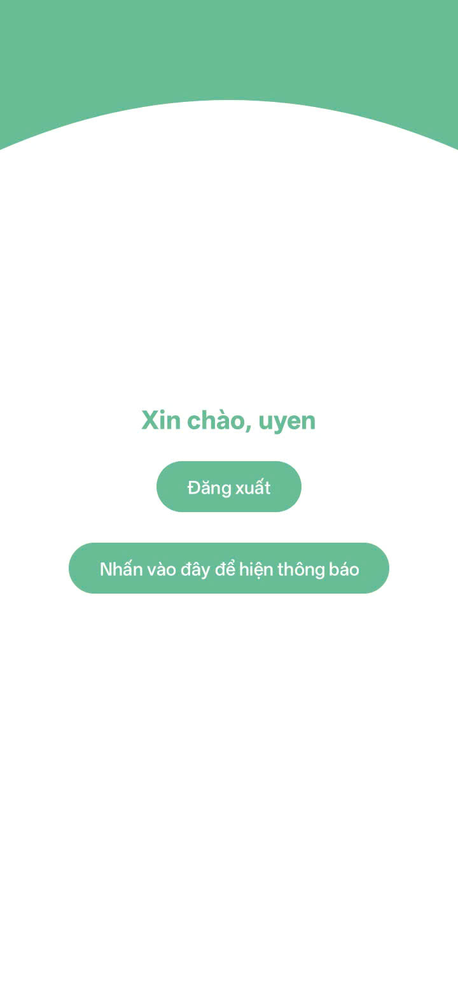
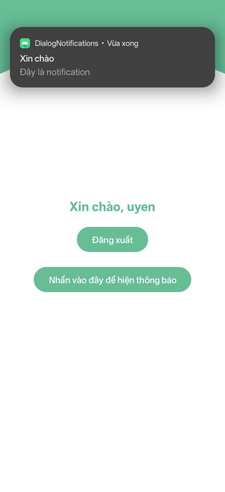
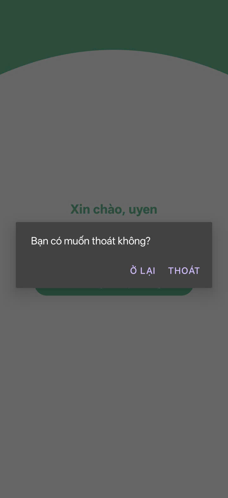
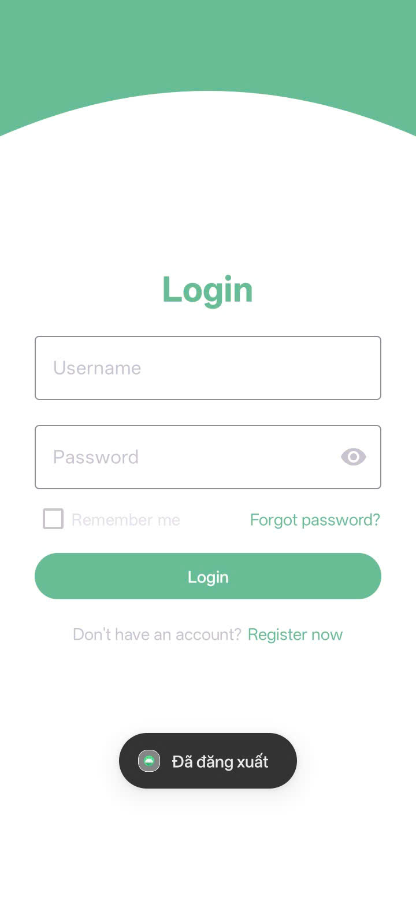

Giao diện home

<table>
  <tr>
    <td>
      
    </td>
  </tr>
</table>

Nhấn nút "Hiện thông báo" để hiển thị thông báo lên trên màn hình.

<table>
  <tr>
    <td>
      
    </td>
  </tr>
</table>

Nhấn "Đăng xuất", mở hộp thoại xác nhận đăng xuất, chọn "Ở lại" thì hộp thoại đóng lại, chọn "Thoát" thì trở về trang đăng nhập.

<table>
  <tr>
    <td>
      
    </td>
  </tr>
</table>

Về trang đăng nhập, hiển thị thông báo (toast) đã đăng xuất ở góc dưới màn hình.

<table>
  <tr>
    <td>
      
    </td>
  </tr>
</table>
