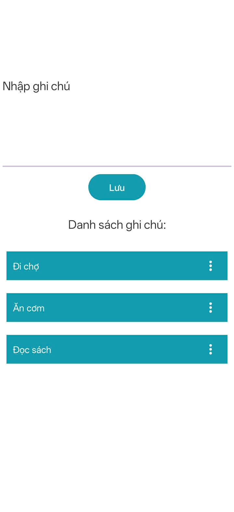
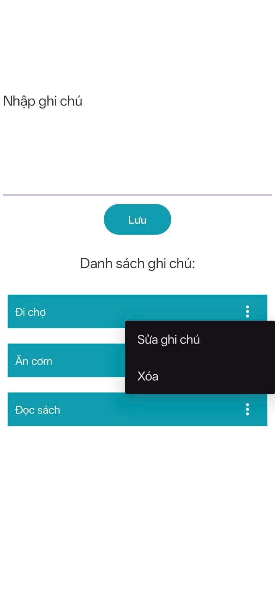
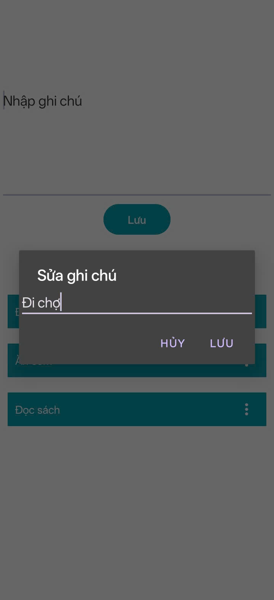

Giao diện app ghi chú

<table>
  <tr>
    <td>
      
    </td>
  </tr>
</table>

Nhấn nút 3 chấm của mỗi item, mở popup menu: chỉnh sửa ghi chú / xóa ghi chú

<table>
  <tr>
    <td>
      
    </td>
  </tr>
</table>

Dialog sửa nội dung ghi chú

<table>
  <tr>
    <td>
      
    </td>
  </tr>
</table>
