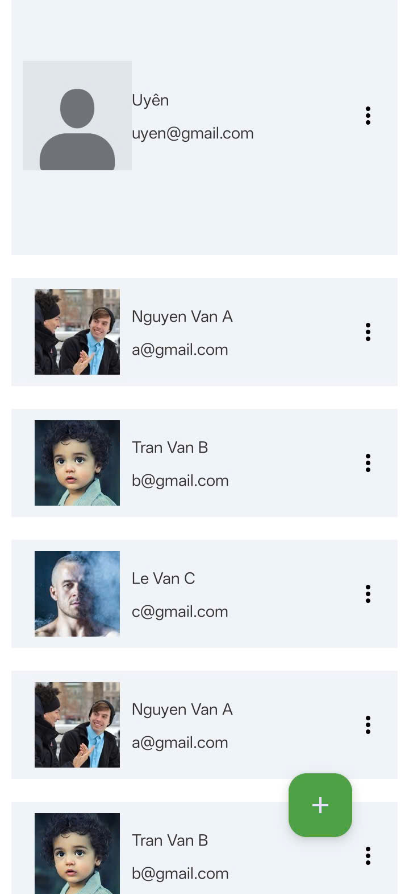
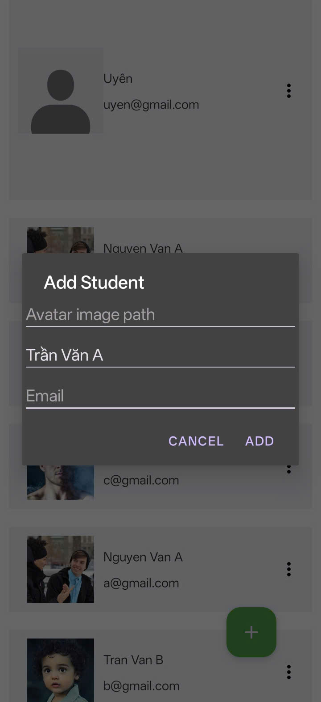
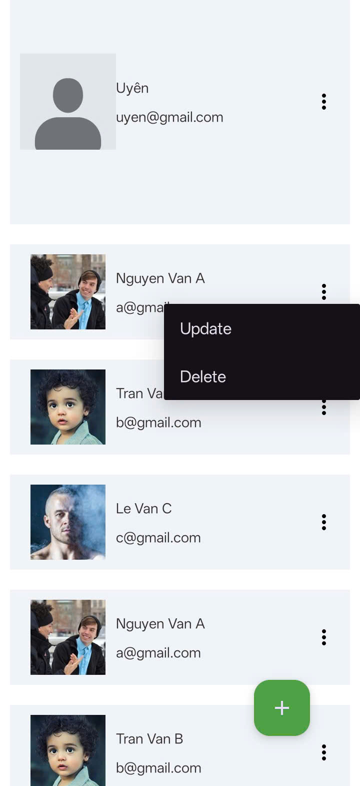
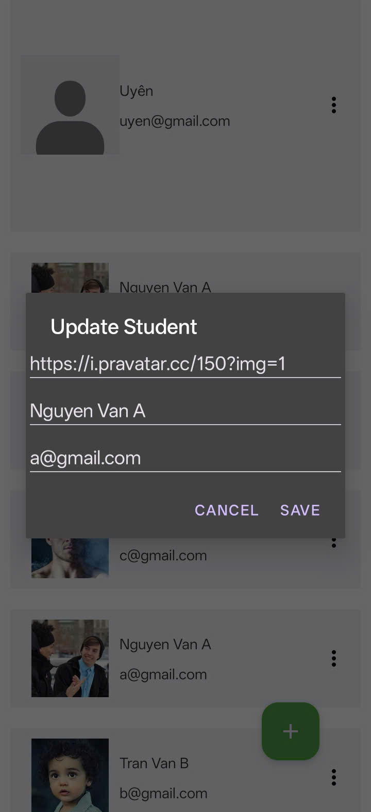

Giao diện hiển thị danh sách học sinh gồm: avatar, name, email.

<table>
  <tr>
    <td>
      
    </td>
  </tr>
</table>

Nhấn nút thêm (+), mở dialog thêm học sinh mới.

<table>
  <tr>
    <td>
      
    </td>
  </tr>
</table>

Nhấn nút 3 chấm của mỗi item, mở popup menu: chỉnh sửa thông tin học sinh / xóa học sinh.

<table>
  <tr>
    <td>
      
    </td>
  </tr>
</table>

Dialog sửa thông tin học sinh.

<table>
  <tr>
    <td>
      
    </td>
  </tr>
</table>
