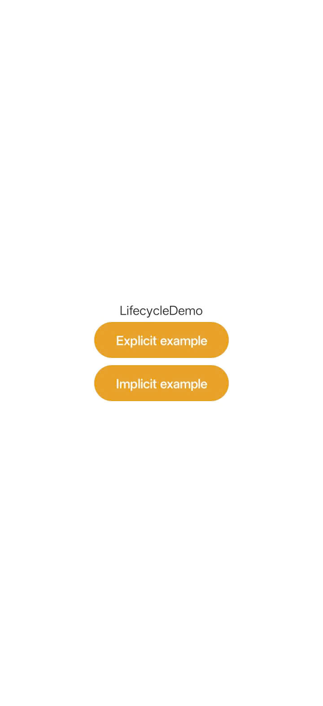
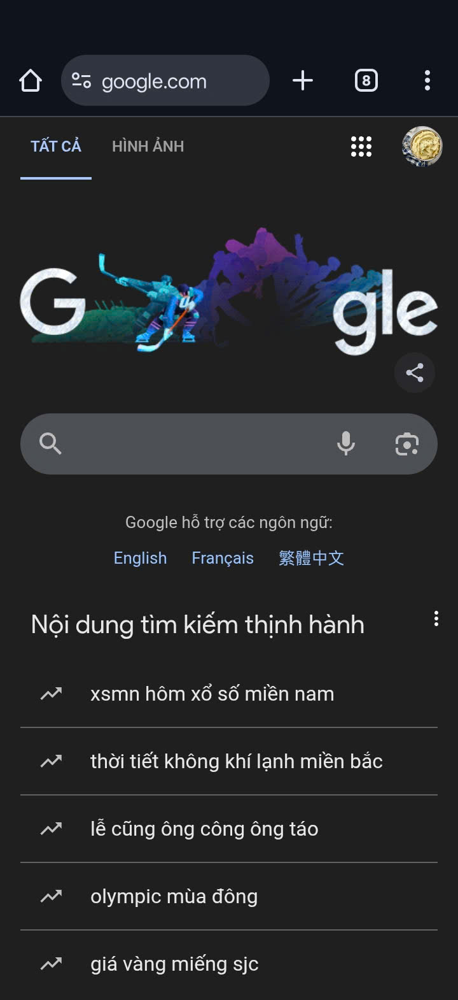

1. Thứ tự các hàm tag Lifecycle được gọi:

Khi xoay màn hình:
- onPause()
- onStop()
- onDestroy()
- onCreate()
- onStart()
- onResume()

Khi bấm nút Home:
- onPause()
- onStop()

Khi vào lại app:
- onRestart()
- onStart()
- onResume()

2. Chạy app
<table>
  <tr>
    <td>
      
    </td>
  </tr>
</table>

Nhấn button Explicit -> chuyển đến trang (class) đã được chỉ định, cụ thể trong code là SubActivity

<table>
  <tr>
    <td>
      
    </td>
  </tr>
</table>

Nhấn button Implicit -> chuyển đến trình duyệt google.com (app tự chọn ứng dụng để mở google.com)

<table>
  <tr>
    <td>
      
    </td>
  </tr>
</table>
